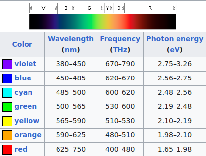

# Hardware List IMATI Jan 2023


500-1000 euro per tre-quattro giorni  


## LIDAR 

##### Hardware at START 4.0

| Name | Price | Image |
| ---  | ---   | ---   |
| [Leica Pegasus:Two Ultimate ](https://leica-geosystems.com/products/mobile-mapping-systems/capture-platforms/leica-pegasus_two-ultimate)[Mobile Sensor Platform](https://www.youtube.com/watch?v=llmEmsEBY1E) {::nomarkdown}{:/} | ALOT k€ |  |
| [Leica RTC360 3D Laser Scanner](https://leica-geosystems.com/it-it/products/laser-scanners/scanners/leica-rtc360) | 73k USD |  |
| [Leica BLK2Go](https://shop.leica-geosystems.com/leica-blk/blk2go) | 50k USD |  |
| [Faro Focus S Plus 150](https://www.geoinstruments.it/prodotto/scanner/faro-focus-s-plus-150/) | 32-42.5k EUR (used on ebay) |  |
| ---  | ---   | ---   |

##### On the market

| Name | Beams | Price | Image |
| ---  | ---   | ---   | ---   |
| [Robosense RS-HELIOS 1610](https://www.roscomponents.com/en/lidar-laser-scanner/344-rs-helios-1610.html) {::nomarkdown}{:/} | 32 beams {::nomarkdown}{:/} | 3.6k EUR |  |
| [Robosense RS-Ruby-80](https://www.roscomponents.com/en/lidar-laser-scanner/343-rs-ruby-80.html) | 80 beams | 13k EUR (early bird) |  |
| [Robosense RS-Ruby Plus](https://www.roscomponents.com/en/lidar-laser-scanner/342-rs-ruby-plus.html) | 128 beams | ??k EUR (prob. ~60k) |  |
| [Robosense RS-LiDAR-M1](https://www.roscomponents.com/en/lidar-laser-scanner/268-rs-lidar-m1.html) | front lidar | 8.5k EUR |  |
| ---  | ---   | ---   |

## Hyperspectral/Multispectral Camera

| Name | Bands | Price | Image |
| ---  | ---   | ---   | ---   |
| [Specim IQ](https://www.specim.com/iq/) {::nomarkdown}{:/} | 400-1000 nm - 204 bands {::nomarkdown}{:/}| 20k USD {::nomarkdown}{:/} |  |
| [Monarch II](https://www.unispectral.com/product/monarch-ii-camera/)[ - Mobile Multispectral Camera](https://www.youtube.com/watch?v=tSBAXayAJwk) | 400-1000 nm - 204 bands | 3,845 USD |  |
| ---  | ---   | ---   | ---   |

## Handheld portable color 3D scanners

| Name | Price | Image |
| ---  | ---   | ---   |
| [Artec Leo](https://www.artec3d.com/portable-3d-scanners/artec-leo) {::nomarkdown}{:/} | 35k EUR (standalone, Jetson TX2 GPU, display) {::nomarkdown}{:/} |  |
| [Sense Pro Precision portable color 3D Scanner](https://it.aliexpress.com/item/1005004132062001.html?gatewayAdapt=glo2ita) | 850 EUR |  |
| [Revopoint MINI 3D Scanner](https://shop.revopoint3d.com/products/revopoint-mini-blue-light-3d-scanner?variant=43464479277291) | 1k EUR |  |
| [iReal 2E Color 3D Scanner](https://www.3d-scantech.com/product/ireal-2e-color-3d-scanner/) | 4k EUR |  |
| [Scan Dimension 3D Scanner SOL](https://it.scandimension.com/products/sol-3d-scanner) | 800 USD |  |
| [DataLogic HandScanner](https://www.datalogic.com/ita/retail-industria-manifatturiera-trasporti-e-logistica-sanita/scanner-barcode-manuali/handscanner-pd-886.html) | 900 EUR |  |
| ---  | ---   | ---   |

## 3D Cameras

| Name | Price | Image |
| ---  | ---   | ---   |
| [Zivid Two L100](https://www.zivid.com/zivid-two-l100) {::nomarkdown}{:/} | 7.5 k EUR {::nomarkdown}{:/} |  |
| [Zivid One+ Academics Kit](https://shop.zivid.com/products/zivid-one-academics-kit) | 9.5k EUR |  |
| ---  | ---   | ---   |

## PCs and GPUs

| Name | Price | Image |
| ---  | ---   | ---   |
| [Titan W599 Octane](https://www.titancomputers.com/Titan-W599-Octane-Dual-2nd-Gen-Intel-Xeon-p/w599-octane.htm) {::nomarkdown}{:/} | 10k EUR {::nomarkdown}{:/} |  |
| [Nvidia GeForce RTX 4090](https://pskmegastore.com/schede-video/127503-gigabyte-geforce-rtx-4090-gaming-oc-24g-4719331311438.html) {::nomarkdown}{:/} | 1.8k EUR {::nomarkdown}{:/} |  |
| ---  | ---   | ---   |


# Lorem ipsum

Lorem ipsum dolor sit amet, consectetur adipiscing elit, sed do eiusmod tempor incididunt ut labore et dolore magna aliqua. Ut enim ad minim veniam, quis nostrud exercitation ullamco laboris nisi ut aliquip ex ea commodo consequat. Duis aute irure dolor in reprehenderit in voluptate velit esse cillum dolore eu fugiat nulla pariatur. Excepteur sint occaecat cupidatat non proident, sunt in culpa qui officia deserunt mollit anim id est laborum.


